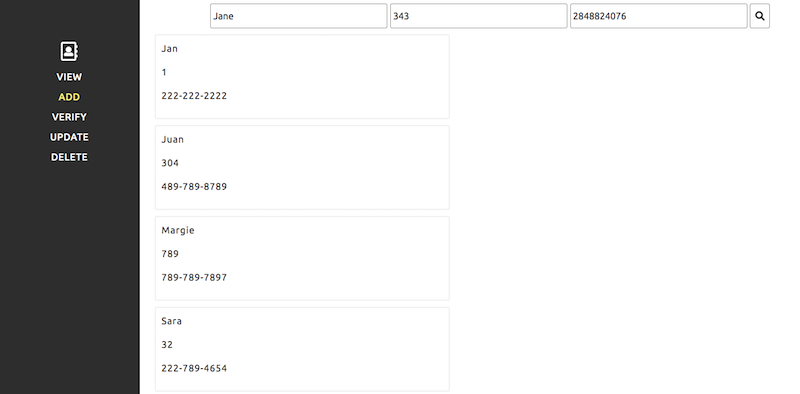
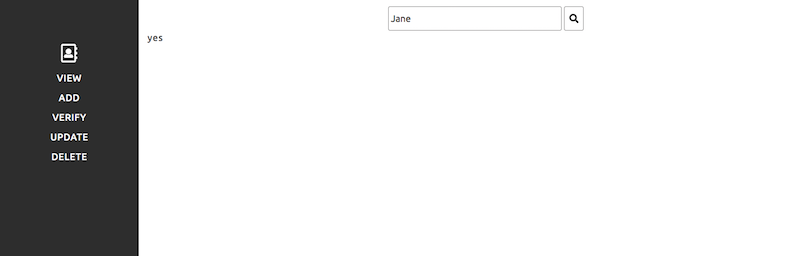

# LFL Employee Directory code challenge

For this assignment you will be building an online employee directory, using only vanilla JS (**no jQuery**).

1. Please fork this repository before starting to work on it
2. Commit changes as if you are working on a team (including realistic commit messages)
3. When you are done, make to push your changes and send a link to your repo back to your recruiter

You should spend no more than 4-6h on this and please make sure to document anything you'd like us to know in the `Dev Notes` section of this `README`

Feel free to reach out to with any questions or for clarification.

## Setup
- No dependencies needed
- Task runners are okay
- `SASS/SCSS` is okay, your choice
- `dom.js` contains some helper functions

## Requirements
#### Sidebar / main content layout is honored per screenshots

#### A `View` option that displays all employees & their info

#### An `Add` option that allows users to input a name, an office number, and a phone number

#### A `Verify` option that allows users to input a name and returns a success/error state to the UI

#### An `Update` option that allows the user to input name, office number, and phone number -- updating only the office number and phone number upon a name match

#### A `Delete` option that deletes the employee with the matching name

## Bonus
- Style all/any of the aforementioned interactions however you see fit, this is an opportunity to show off your creativity!
- MVC JS architecture

## Dev notes

### MVC Arquitecture
`**app.js**` with the App class we can create object components and which will be handled through the MVC Architecture.\
`**router.js**` is looking at window.location hash waithing for a change or a Dom reload to check route and if it matches with component execute the view function of the component

### Functionality

**Search Bar :**  When using search input, the employees will be filtered to match it.\
**Employee Card :** Click for a closer look and more options.\
**Add Employee :**  You can add Employees .\
**Delete Employee :**  You can delete Employees .\
**Edit Employee :**  You can edit Employees .\
> **Search case :** if editing an employee resulting from a search the name will not be modificable.

>#Project was started out of repo at first to grasp the workflow of creating an MVC architecture

